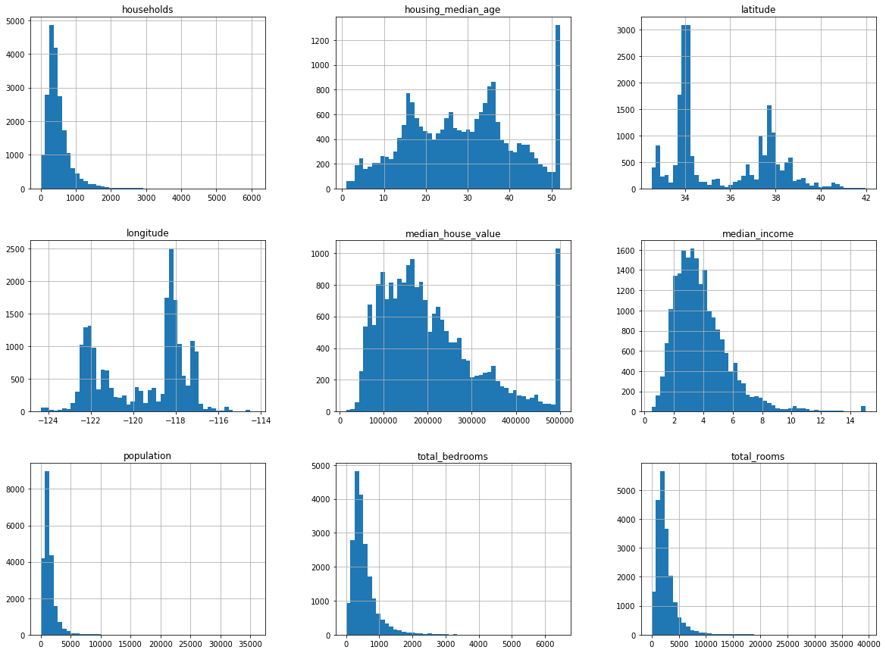
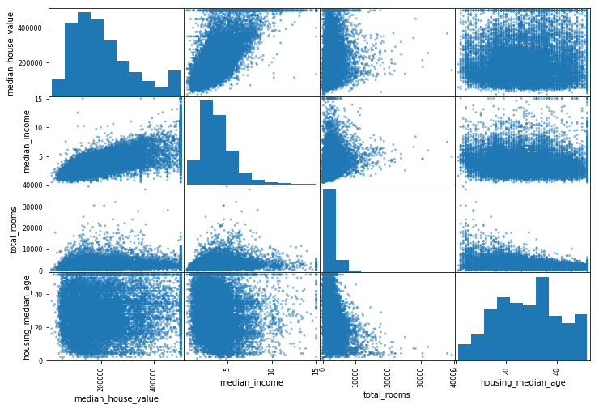
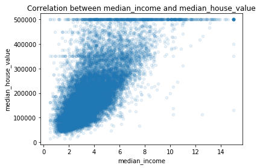

```python
import os
import tarfile
from six.moves import urllib
import pandas as pd
import numpy as np
import matplotlib.pyplot as plt
%matplotlib inline # only in a Jupyter notebook
plt.style.use('ggplot')
```

    UsageError: unrecognized arguments: # only in a Jupyter notebook
    


```python
DOWNLOAD_ROOT = "https://raw.githubusercontent.com/ageron/handson-ml/master/"
HOUSING_PATH = "datasets/housing"
HOUSING_URL = DOWNLOAD_ROOT + HOUSING_PATH + "/housing.tgz"

def fetching_house_data(housing_url = HOUSING_URL, housing_path = HOUSING_PATH):
    if not os.path.isdir(housing_path):
        os.makedirs(housing_path)
    tgz_path = os.path.join(housing_path, 'housing.tgz')
    urllib.request.urlretrieve(housing_url, tgz_path)
    housing_tgz = tarfile.open(tgz_path)
    housing_tgz.extractall(path = housing_path)
    housing_tgz.close()

fetching_house_data()
```


```python
def loading_housing_data(housing_path = HOUSING_PATH):
    csv_path = os.path.join(housing_path, "housing.csv")
    return pd.read_csv(csv_path)

housing = loading_housing_data()
housing.head()
```


<div>
<style>
    .dataframe thead tr:only-child th {
        text-align: right;
    }

    .dataframe thead th {
        text-align: left;
    }

    .dataframe tbody tr th {
        vertical-align: top;
    }
</style>
<table border="1" class="dataframe">
  <thead>
    <tr style="text-align: right;">
      <th></th>
      <th>longitude</th>
      <th>latitude</th>
      <th>housing_median_age</th>
      <th>total_rooms</th>
      <th>total_bedrooms</th>
      <th>population</th>
      <th>households</th>
      <th>median_income</th>
      <th>median_house_value</th>
      <th>ocean_proximity</th>
    </tr>
  </thead>
  <tbody>
    <tr>
      <th>0</th>
      <td>-122.23</td>
      <td>37.88</td>
      <td>41.0</td>
      <td>880.0</td>
      <td>129.0</td>
      <td>322.0</td>
      <td>126.0</td>
      <td>8.3252</td>
      <td>452600.0</td>
      <td>NEAR BAY</td>
    </tr>
    <tr>
      <th>1</th>
      <td>-122.22</td>
      <td>37.86</td>
      <td>21.0</td>
      <td>7099.0</td>
      <td>1106.0</td>
      <td>2401.0</td>
      <td>1138.0</td>
      <td>8.3014</td>
      <td>358500.0</td>
      <td>NEAR BAY</td>
    </tr>
    <tr>
      <th>2</th>
      <td>-122.24</td>
      <td>37.85</td>
      <td>52.0</td>
      <td>1467.0</td>
      <td>190.0</td>
      <td>496.0</td>
      <td>177.0</td>
      <td>7.2574</td>
      <td>352100.0</td>
      <td>NEAR BAY</td>
    </tr>
    <tr>
      <th>3</th>
      <td>-122.25</td>
      <td>37.85</td>
      <td>52.0</td>
      <td>1274.0</td>
      <td>235.0</td>
      <td>558.0</td>
      <td>219.0</td>
      <td>5.6431</td>
      <td>341300.0</td>
      <td>NEAR BAY</td>
    </tr>
    <tr>
      <th>4</th>
      <td>-122.25</td>
      <td>37.85</td>
      <td>52.0</td>
      <td>1627.0</td>
      <td>280.0</td>
      <td>565.0</td>
      <td>259.0</td>
      <td>3.8462</td>
      <td>342200.0</td>
      <td>NEAR BAY</td>
    </tr>
  </tbody>
</table>
</div>


```python
# Step1: Get to Know Your Data
print ("-------A Quick Overview:-------")
print (housing.info())
print ("\n-------ocean_proximity categories:-------\n", housing['ocean_proximity'].value_counts())
print ("\n-------Numerical Arrributes Summary:-------\n", housing.describe())

print ("\n-------Create A Histogram for Each Numerical Attributes-------\n")

housing.hist(bins = 50, figsize = (20,15))
plt.show()
```

    -------A Quick Overview:-------
    <class 'pandas.core.frame.DataFrame'>
    RangeIndex: 20640 entries, 0 to 20639
    Data columns (total 10 columns):
    longitude             20640 non-null float64
    latitude              20640 non-null float64
    housing_median_age    20640 non-null float64
    total_rooms           20640 non-null float64
    total_bedrooms        20433 non-null float64
    population            20640 non-null float64
    households            20640 non-null float64
    median_income         20640 non-null float64
    median_house_value    20640 non-null float64
    ocean_proximity       20640 non-null object
    dtypes: float64(9), object(1)
    memory usage: 1.6+ MB
    None
    
    -------ocean_proximity categories:-------
     <1H OCEAN     9136
    INLAND        6551
    NEAR OCEAN    2658
    NEAR BAY      2290
    ISLAND           5
    Name: ocean_proximity, dtype: int64
    
    -------Numerical Arrributes Summary:-------
               longitude      latitude  housing_median_age   total_rooms  \
    count  20640.000000  20640.000000        20640.000000  20640.000000   
    mean    -119.569704     35.631861           28.639486   2635.763081   
    std        2.003532      2.135952           12.585558   2181.615252   
    min     -124.350000     32.540000            1.000000      2.000000   
    25%     -121.800000     33.930000           18.000000   1447.750000   
    50%     -118.490000     34.260000           29.000000   2127.000000   
    75%     -118.010000     37.710000           37.000000   3148.000000   
    max     -114.310000     41.950000           52.000000  39320.000000   
    
           total_bedrooms    population    households  median_income  \
    count    20433.000000  20640.000000  20640.000000   20640.000000   
    mean       537.870553   1425.476744    499.539680       3.870671   
    std        421.385070   1132.462122    382.329753       1.899822   
    min          1.000000      3.000000      1.000000       0.499900   
    25%        296.000000    787.000000    280.000000       2.563400   
    50%        435.000000   1166.000000    409.000000       3.534800   
    75%        647.000000   1725.000000    605.000000       4.743250   
    max       6445.000000  35682.000000   6082.000000      15.000100   
    
           median_house_value  
    count        20640.000000  
    mean        206855.816909  
    std         115395.615874  
    min          14999.000000  
    25%         119600.000000  
    50%         179700.000000  
    75%         264725.000000  
    max         500001.000000  
    
    -------Create A Histogram for Each Numerical Attributes-------
    
    





```python
# Step 2: Creare a Test Dataset

'''Random Sampling
'''
def split_train_test(data, test_ratio):
    np.random.seed(42) # used to make sure every time random permutation yields the same results
    shuffled_indices = np.random.permutation(len(data))
    test_set_size = int(len(data) * test_ratio)
    test_indices = shuffled_indices[:test_set_size]
    train_indices = shuffled_indices[test_set_size:]
    return data.iloc[train_indices], data.iloc[test_indices]

train_set, test_set = split_train_test(housing, 0.2)
print (len(train_set), "train +", len(test_set), "test")

# Altenative function in scikitlearn
from sklearn.model_selection import train_test_split
train_set, test_set = train_test_split(housing, test_size=0.2, random_state=43)
```

    16512 train + 4128 test
    


```python
# Step 2: Creare a Test Dataset

'''Stratify Sampling
'''

'''Income (continuous)
Most median income values are clustered around 2–5 (tens of thousands of dollars), but some median
incomes go far beyond 6. It is important to have a sufficient number of instances in your dataset for each
stratum, or else the estimate of the stratum’s importance may be biased. This means that you should not
have too many strata, and each stratum should be large enough. The following code creates an income
category attribute by dividing the median income by 1.5 (to limit the number of income categories), and
rounding up using ceil (to have discrete categories), and then merging all the categories greater than 5
into category 5
'''
housing["income_cat"] = np.ceil(housing["median_income"] / 1.5)
housing["income_cat"].where(housing["income_cat"] < 5, 5.0, inplace=True)

## Do stratified sampling based on the income category
from sklearn.model_selection import StratifiedShuffleSplit

split = StratifiedShuffleSplit(n_splits=1, test_size=0.2, random_state=42)
for train_index, test_index in split.split(housing, housing["income_cat"]):
    strat_train_set = housing.loc[train_index]
    strat_test_set = housing.loc[test_index]
    
print (housing["income_cat"].value_counts() / len(housing))

## Remove income_cat attribute
for set in (strat_train_set, strat_test_set):
    set.drop(["income_cat"], axis=1, inplace=True)
```

    3.0    0.350581
    2.0    0.318847
    4.0    0.176308
    5.0    0.114438
    1.0    0.039826
    Name: income_cat, dtype: float64
    


```python
housing.columns
```


    Index(['longitude', 'latitude', 'housing_median_age', 'total_rooms',
           'total_bedrooms', 'population', 'households', 'median_income',
           'median_house_value', 'ocean_proximity', 'income_cat'],
          dtype='object')


```python
# Step 3: Explore Data - discover and visualize the data to gain insights

housing = strat_train_set.copy() # leave test dataset alone

'''Visualize Geographical Data
'''
housing.plot(kind = 'scatter', 
             x = 'longitude', 
             y = 'latitude', 
             alpha = 0.1, 
             title = 'Plot1 - Highlighting High-Density Areas')

housing.plot(kind="scatter", 
             x="longitude", 
             y="latitude", 
             alpha=0.5,
             s=housing["population"]/100, label="population",
             c="median_house_value", cmap=plt.get_cmap("jet"), colorbar=True,
             title = "Plot2 - Visulization of Geographic Location, Population and Housing Price"
) 
plt.legend()
plt.show()
```


    ---------------------------------------------------------------------------

    NameError                                 Traceback (most recent call last)

    <ipython-input-2-120baf869493> in <module>()
          1 # Step 3: Explore Data - discover and visualize the data to gain insights
          2 
    ----> 3 housing = strat_train_set.copy() # leave test dataset alone
          4 
          5 '''Visualize Geographical Data
    

    NameError: name 'strat_train_set' is not defined


```python
# Step 3: Explore Data - discover and visualize the data to gain insights

'''Looking for Correlations - correlation coefficient only measures linear correlations
'''

# create correlation matrix
corr_matrix = housing.corr()
print ("Correlation between house value and other attributes:\n", corr_matrix['median_house_value'].sort_values(ascending = False))

# visualize correlation matrix
from pandas.tools.plotting import scatter_matrix
attributes = ["median_house_value", "median_income", "total_rooms","housing_median_age"]
scatter_matrix(housing[attributes], figsize=(12, 8)) # visualize attributes that seem to be highly correlated

# zoom in to most prominent variable
housing.plot(kind="scatter", x="median_income", y="median_house_value",alpha=0.1, title = "Correlation between median_income and median_house_value")
plt.show()

```

    Correlation between house value and other attributes:
     median_house_value    1.000000
    median_income         0.687160
    total_rooms           0.135097
    housing_median_age    0.114110
    households            0.064506
    total_bedrooms        0.047689
    population           -0.026920
    longitude            -0.047432
    latitude             -0.142724
    Name: median_house_value, dtype: float64
    

    C:\Users\cwang\AppData\Local\Continuum\Anaconda3\lib\site-packages\ipykernel_launcher.py:13: FutureWarning: 'pandas.tools.plotting.scatter_matrix' is deprecated, import 'pandas.plotting.scatter_matrix' instead.
      del sys.path[0]
    








```python
'''Experimenting with Attribute Combinations
'''

# find some potential useful attributes
housing["rooms_per_household"] = housing["total_rooms"]/housing["households"]
housing["bedrooms_per_room"] = housing["total_bedrooms"]/housing["total_rooms"]
housing["population_per_household"]=housing["population"]/housing["households"]

# look at correlation again
corr_matrix = housing.corr()
corr_matrix["median_house_value"].sort_values(ascending=False)
```


    median_house_value          1.000000
    median_income               0.687160
    rooms_per_household         0.146285
    total_rooms                 0.135097
    housing_median_age          0.114110
    households                  0.064506
    total_bedrooms              0.047689
    population_per_household   -0.021985
    population                 -0.026920
    longitude                  -0.047432
    latitude                   -0.142724
    bedrooms_per_room          -0.259984
    Name: median_house_value, dtype: float64


```python
# Step 4: Prepare the Data for Machine Learning Algorithms
housing = strat_train_set.drop("median_house_value", axis=1)
housing_labels = strat_train_set["median_house_value"].copy()

'''Data Cleaning
1. missing values
   - option 1: get rid of the corresponding districts
   - option 2: get rid of the whole attribute
   - option 3: set the values to some value ( 0, the mean, media etc.)
'''

# diy
housing.dropna(subset = ['total_bedrooms']) #option 1
housing.drop('total_bedrooms', axis = 1) #option 2
median = housing['total_bedrooms'].median() #option 3
housing['total_bedrooms'].fillna(median)

# use Imputer in scikit-learn
from sklearn.preprocessing import Imputer
imputer = Imputer(strategy="median") # imputer is an estimator
housing_num = housing.drop("ocean_proximity", axis=1) # the median can only be computed on numerical attributes
imputer.fit(housing_num) # calculate median for all numerical attributes since you are not sure which attribute will have missing data some day.
print (imputer.statistics_)
print (housing_num.median().values)

x = imputer.transform(housing_num) # transform the dataset
housing_tr = pd.DataFrame(x, columns = housing_num.columns)


'''Data Cleaning
2. Handling Text and Categorical Attributes
   - convert them to numbers.
'''

# scikit learn - labelencoder
from sklearn.preprocessing import LabelEncoder

## Convert in 2 steps
# convert attributes to numerical values
encoder = LabelEncoder() # initiate the class
housing_cat = housing['ocean_proximity']
housing_cat_encoded = encoder.fit_transform(housing_cat)
print(housing_cat_encoded, "\nOne issue with this representation is that ML algorithms will assume that two nearby values are more similar than two distant values")

# to fix the issue, a common solution is to create one binary attribute per category - one-hot-encoding
from sklearn.preprocessing import OneHotEncoder
encoder = OneHotEncoder()
housing_cat_1hot = encoder.fit_transform(housing_cat_encoded.reshape(-1,1))

housing_cat_1hot # scipy sparse matrix
housing_cat_1hot.toarray() # convert to a dense numpy array

## Convert in 1 step
from sklearn.preprocessing import LabelBinarizer
encoder = LabelBinarizer() # sparse_output=True to decide output sparse matrix or dense array

housing_cat_1hot = encoder.fit_transform(housing_cat)
housing_cat_1hot
```

    [-118.51     34.26     29.     2119.5     433.     1164.      408.
        3.5409]
    [-118.51     34.26     29.     2119.5     433.     1164.      408.
        3.5409]
    [0 0 4 ... 1 0 3] 
    One issue with this representation is that ML algorithms will assume that two nearby values are more similar than two distant values
    


    array([[1, 0, 0, 0, 0],
           [1, 0, 0, 0, 0],
           [0, 0, 0, 0, 1],
           ...,
           [0, 1, 0, 0, 0],
           [1, 0, 0, 0, 0],
           [0, 0, 0, 1, 0]])


```python
'''Data Cleaning
3. Cusomer Transfomers
   -duck typing (not inheritance), all you need is to create a class and implement three methods: 
   fit() (returning self), transform(), and fit_transform().
'''

from sklearn.base import BaseEstimator, TransformerMixin

rooms_ix, bedrooms_ix, population_ix, household_ix = 3,4,5,6

class CombinedAttributesAdder(BaseEstimator, TransformerMixin):
    def __init__(self, add_bedrooms_per_room = True):
        self.add_bedrooms_per_room = add_bedrooms_per_room
        
    def fit(self, x, y=None):
        return self # nonthing else to do
    def transform(self, X, y = None):
        rooms_per_household = X[:, rooms_ix]/X[:, household_ix]
        population_per_household = X[:, population_ix]/X[:, household_ix]
        if self.add_bedrooms_per_room:
            bedrooms_per_room = X[:, bedrooms_ix]/ X[:, rooms_ix]
            return np.c_[X,rooms_per_household, population_per_household,
                        bedrooms_per_room]

        else:
            return np.c_[X, rooms_per_household, population_per_household]
        
attr_adder = CombinedAttributesAdder(add_bedrooms_per_room = False)
housing_extra_attribs = attr_adder.transform(housing.values)

'''Data Cleaning
4. Feature Scaling
   - scaling the target values is generally not required
        - method 1: min-max scaling(normalization): values are shifted and rescaled so that they end up ranging from 0 to 1 - MinMaxScaler
        - method 2: standardization; first it subtracts the mean value (so standardized values always have a zero mean), and then it divides by the variance so that the resulting distribution has unit variance. -standardScaler

Unlike min-max scaling, standardization does not bound values to a specific range, which may be a problem for
some algorithms (e.g., neural networks often expect an input value ranging from 0 to 1). However,
standardization is much less affected by outliers.

As with all the transformations, it is important to fit the scalers to the training data only, not to the full dataset (including the test set). Only then can you use them to transform the training set and the test set (and new data).
'''

```


    'Data Cleaning\n4. Feature Scaling\n   - scaling the target values is generally not required\n        - method 1: min-max scaling(normalization): values are shifted and rescaled so that they end up ranging from 0 to 1 - MinMaxScaler\n        - method 2: standardization; first it subtracts the mean value (so standardized values always have a zero mean), and then it divides by the variance so that the resulting distribution has unit variance. -standardScaler\n\nUnlike min-max scaling, standardization does not bound values to a specific range, which may be a problem for\nsome algorithms (e.g., neural networks often expect an input value ranging from 0 to 1). However,\nstandardization is much less affected by outliers.\n\nAs with all the transformations, it is important to fit the scalers to the training data only, not to the full dataset (including the test set). Only then can you use them to transform the training set and the test set (and new data).\n'


```python
'''Date Cleaning
pipeline class for numerical values:
- As you can see, there are many data transformation steps that need to be executed in the right order.
Fortunately, Scikit-Learn provides the Pipeline class to help with such sequences of transformations.
'''
from sklearn.pipeline import Pipeline
from sklearn.preprocessing import StandardScaler
num_pipeline = Pipeline([
('imputer', Imputer(strategy="median")),
('attribs_adder', CombinedAttributesAdder()),
('std_scaler', StandardScaler()), 
])
housing_num_tr = num_pipeline.fit_transform(housing_num) 
# All but the last estimator must be transformers (i.e., they must have a fit_transform() method).
'''Date Cleaning
FeatureUnion
- You give it a list of transformers (which can be entire transformer
pipelines), and when its transform() method is called it runs each transformer’s transform() method
in parallel, waits for their output, and then concatenates them and returns the result (and of course calling
its fit() method calls all each transformer’s fit() method). A full pipeline handling both numerical and
categorical attributes may look like this
'''
from sklearn.pipeline import FeatureUnion
import sklearn_features
from sklearn_features.transformers import DataFrameSelector

num_attribs = list(housing_num)
cat_attribs = ["ocean_proximity"]

num_pipeline = Pipeline([
('selector', DataFrameSelector(num_attribs)), # selectoer transformer - select numerical attributes, drop categorical attributes
('imputer', Imputer(strategy="median")),
('attribs_adder', CombinedAttributesAdder()),
('std_scaler', StandardScaler()),
])

cat_pipeline = Pipeline([
('selector', DataFrameSelector(cat_attribs)),
('label_binarizer', LabelBinarizer()),
])

full_pipeline = FeatureUnion(transformer_list=[
("num_pipeline", num_pipeline),
("cat_pipeline", cat_pipeline),
])

# run the whole pipline
housing_prepared = full_pipeline.fit_transform(housing)
housing_prepared
```


    array([[-1.15604281,  0.77194962,  0.74333089, ...,  0.        ,
             0.        ,  0.        ],
           [-1.17602483,  0.6596948 , -1.1653172 , ...,  0.        ,
             0.        ,  0.        ],
           [ 1.18684903, -1.34218285,  0.18664186, ...,  0.        ,
             0.        ,  1.        ],
           ...,
           [ 1.58648943, -0.72478134, -1.56295222, ...,  0.        ,
             0.        ,  0.        ],
           [ 0.78221312, -0.85106801,  0.18664186, ...,  0.        ,
             0.        ,  0.        ],
           [-1.43579109,  0.99645926,  1.85670895, ...,  0.        ,
             1.        ,  0.        ]])


```python
'''Training and Evaluating on the Training Set
1. Linear Regression
'''
from sklearn.linear_model import LinearRegression
lin_reg = LinearRegression()
lin_reg.fit(housing_prepared,housing_labels)

some_data = housing.iloc[:5]
some_labels = housing_labels.iloc[:5]
some_data_prepared = full_pipeline.transform(some_data)
print("Predictions:\n", lin_reg.predict(some_data_prepared))
print("Labels:\n", list(some_labels))

# Measure RMSE
from sklearn.metrics import mean_squared_error
housing_predictions = lin_reg.predict(housing_prepared)
lin_mse = mean_squared_error(housing_labels, housing_predictions)
lin_rmse = np.sqrt(lin_mse)

print ("RMSE:\n", lin_rmse)
'''The mode is underfitting data. the main ways to fix underfitting are to 
1. select a more powerful model, 
2. to feed the training algorithm with better features, (transform the features)
3. or to reduce the constraints on the model (remove regularization)
'''
```

    Predictions:
     [210644.60459286 317768.80697211 210956.43331178  59218.98886849
     189747.55849879]
    Labels:
     [286600.0, 340600.0, 196900.0, 46300.0, 254500.0]
    RMSE:
     68628.19819848923
    


    'The mode is underfitting data. the main ways to fix underfitting are to \n1. select a more powerful model, \n2. to feed the training algorithm with better features, (transform the features)\n3. or to reduce the constraints on the model (remove regularization)\n'


```python
'''Training and Evaluating on the Training Set
2. Decision Tree - capable of finding complex nonlinear relationships
'''
from sklearn.tree import DecisionTreeRegressor
tree_reg = DecisionTreeRegressor()
tree_reg.fit(housing_prepared, housing_labels)
housing_predictions = tree_reg.predict(housing_prepared)
tree_mse = mean_squared_error(housing_labels, housing_predictions)
tree_rmse = np.sqrt(tree_mse)
tree_rmse

'''The model is overfitting the data 
'''
```


    'The model is overfitting the data \n'


```python
'''Training and Evaluating on the Training Set
3. Random Forest
Random
Forests work by training many Decision Trees on random subsets of the features, then averaging out their
predictions. Building a model on top of many other models is called Ensemble Learning, and it is often a
great way to push ML algorithms even further.
'''

from sklearn.ensemble import RandomForestRegressor
forest_reg = RandomForestRegressor(random_state=42)
forest_reg.fit(housing_prepared, housing_labels)

housing_predictions = forest_reg.predict(housing_prepared)
forest_mse = mean_squared_error(housing_labels, housing_predictions)
forest_rmse = np.sqrt(forest_mse)
print ("forest_rmse", forest_mse)


```

    forest_rmse 481447459.5334702
    Scores: [51650.94405471 48920.80645498 52979.16096752 54412.74042021
     50861.29381163 56488.55699727 51866.90120786 49752.24599537
     55399.50713191 53309.74548294]
    Mean: 52564.19025244012
    Standard deviation: 2301.873803919754
    


```python
'''Training and Evaluating on the Training Set
Validation:
- train_test_split
- corss_validation: The following code performs K-fold cross-validation: it randomly splits the training set into 10 distinct subsets called folds, then it trains and
evaluates the Decision Tree model 10 times, picking a different fold for evaluation every time and
training on the other 9 folds.

cross-validation features expect a utility function (greater is better) rather than a cost function (lower is better), so
the scoring function is actually the opposite of the MSE
'''
def display_scores(scores):
    print ("Scores:", scores)
    print("Mean:", scores.mean())
    print("Standard deviation:", scores.std())

    
from sklearn.model_selection import cross_val_score
scores = cross_val_score(tree_reg, 
                         housing_prepared, 
                         housing_labels,
                         scoring="neg_mean_squared_error", cv=10)
tree_rmse_scores = np.sqrt(-scores)


lin_scores = cross_val_score(lin_reg, 
                             housing_prepared, 
                             housing_labels, 
                             scoring="neg_mean_squared_error", 
                             cv=10)
lin_rmse_scores = np.sqrt(-lin_scores)


forcast_scores = cross_val_score(forest_reg, 
                                 housing_prepared, 
                                 housing_labels,
                                 scoring = 'neg_mean_squared_error',
                                 cv = 10)
forcast_rmse_scores = np.sqrt(-forcast_scores)

print ("linear regression: \n")
display_scores(lin_rmse_scores)
print ("decision tree: \n")
display_scores(tree_rmse_scores)
print ("random forest: \n)
display_scores(forcast_rmse_scores)
```

    linear regression: 
    
    Scores: [66782.73843989 66960.118071   70347.95244419 74739.57052552
     68031.13388938 71193.84183426 64969.63056405 68281.61137997
     71552.91566558 67665.10082067]
    Mean: 69052.46136345083
    Standard deviation: 2731.6740017983466
    decision tree: 
    
    Scores: [68544.02003713 67161.79419822 70763.69631874 69947.57007372
     71137.106425   73929.07353615 70925.97919276 70112.96495946
     76919.52282775 70305.32710646]
    Mean: 70974.70546753719
    Standard deviation: 2585.2391095013268
    Scores: [51650.94405471 48920.80645498 52979.16096752 54412.74042021
     50861.29381163 56488.55699727 51866.90120786 49752.24599537
     55399.50713191 53309.74548294]
    Mean: 52564.19025244012
    Standard deviation: 2301.873803919754
    

# Fine - tune your Model

APPROACH 1 - GRID SEARCH

One way to do that would be to fiddle with the hyperparameters manually, until you find a great combination of hyperparameter values. - Use Scikit-Learn’s GridSearchCV.

All you need to do is tell it which hyperparameters you want it to experiment with, and what values to try out, and it will evaluate all the possible combinations of hyperparameter values, using cross-validation


```python
from sklearn.model_selection import GridSearchCV

param_grid = [
    {'n_estimators': [3,10,30], 'max_features':[2,4,6,8]},
    {'bootstrap':[False], 'n_estimators':[3,10],'max_features':[2,3,4]}
]

forest_reg = RandomForestRegressor()
grid_search = GridSearchCV(forest_reg, param_grid,
                          cv = 5, scoring = 'neg_mean_squared_error')

grid_search.fit(housing_prepared, housing_labels)
print ("the best combination of parameters are: ", grid_search.best_params_)
print ("the best estimators are: ", grid_search.best_estimator_)

print ("evaluation scores:")
cvres = grid_search.cv_results_
for mean_score, params in zip(cvres['mean_test_score'], cvres['params']):
    print (np.sqrt(-mean_score), params)
```


    GridSearchCV(cv=5, error_score='raise',
           estimator=RandomForestRegressor(bootstrap=True, criterion='mse', max_depth=None,
               max_features='auto', max_leaf_nodes=None,
               min_impurity_split=1e-07, min_samples_leaf=1,
               min_samples_split=2, min_weight_fraction_leaf=0.0,
               n_estimators=10, n_jobs=1, oob_score=False, random_state=None,
               verbose=0, warm_start=False),
           fit_params={}, iid=True, n_jobs=1,
           param_grid=[{'n_estimators': [3, 10, 30], 'max_features': [2, 4, 6, 8]}, {'bootstrap': [False], 'n_estimators': [3, 10], 'max_features': [2, 3, 4]}],
           pre_dispatch='2*n_jobs', refit=True, return_train_score=True,
           scoring='neg_mean_squared_error', verbose=0)


APPROACH 2 - RANDOMIZED SEARCH

The grid search approach is fine when you are exploring relatively few combinations, like in the previous example, but when the hyperparameter search space is large, it is often preferable to use RandomizedSearchCV instead. This class can be used in much the same way as the GridSearchCV class, but instead of trying out all possible combinations, it evaluates a given number of random combinations by selecting a random value for each hyperparameter at every iteration. 

- This approach has two main benefits

1. If you let the randomized search run for, say, 1,000 iterations, this approach will explore 1,000 different values for each hyperparameter (instead of just a few values per hyperparameter with the grid search approach).

2. You have more control over the computing budget you want to allocate to hyperparameter search, simply by setting the number of iterations.

APPROACH 3 - ENSEMBLE METHODS

Another way to fine-tune your system is to try to combine the models that perform best. The group (or “ensemble”) will often perform better than the best individual model (just like Random Forests perform better than the individual Decision Trees they rely on), especially if the individual models make very different types of errors

# Analyze the Best Models and Their Errors


```python
# feature importance
feature_importances = grid_search.best_estimator_.feature_importances_
feature_importances

# extra attributes
extra_attribs = ["rooms_per_hhold", "pop_per_hhold", "bedrooms_per_room"]
cat_one_hot_attribs = list(encoder.classes_)
attributes = num_attribs + extra_attribs + cat_one_hot_attribs
sorted(zip(feature_importances, attributes), reverse=True)
```


    [(0.36920668043519983, 'median_income'),
     (0.16482201910822653, 'INLAND'),
     (0.10706902791661771, 'pop_per_hhold'),
     (0.06980261281461299, 'longitude'),
     (0.06368987447168789, 'latitude'),
     (0.06319085362118974, 'bedrooms_per_room'),
     (0.04513996209261038, 'rooms_per_hhold'),
     (0.04286821027170195, 'housing_median_age'),
     (0.016250370131303295, 'total_rooms'),
     (0.015281353138251656, 'population'),
     (0.014899087441975897, 'households'),
     (0.014476135922620391, 'total_bedrooms'),
     (0.008475994286871109, '<1H OCEAN'),
     (0.0031080702239591734, 'NEAR OCEAN'),
     (0.0015948791567309494, 'NEAR BAY'),
     (0.000124868966440508, 'ISLAND')]


```python
'''Evaluate Your System on the Test Set
The performance will usually be slightly worse than what you measured using cross-validation if you did
a lot of hyperparameter tuning (because your system ends up fine-tuned to perform well on the validation
data, and will likely not perform as well on unknown datasets). It is not the case in this example, but when
this happens you must resist the temptation to tweak the hyperparameters to make the numbers look good
on the test set; the improvements would be unlikely to generalize to new data.
'''

final_model = grid_search.best_estimator_
X_test = strat_test_set.drop("median_house_value", axis=1)
y_test = strat_test_set["median_house_value"].copy()
X_test_prepared = full_pipeline.transform(X_test)
final_predictions = final_model.predict(X_test_prepared)
final_mse = mean_squared_error(y_test, final_predictions)
final_rmse = np.sqrt(final_mse)
final_rmse
```


    48225.258740086305


